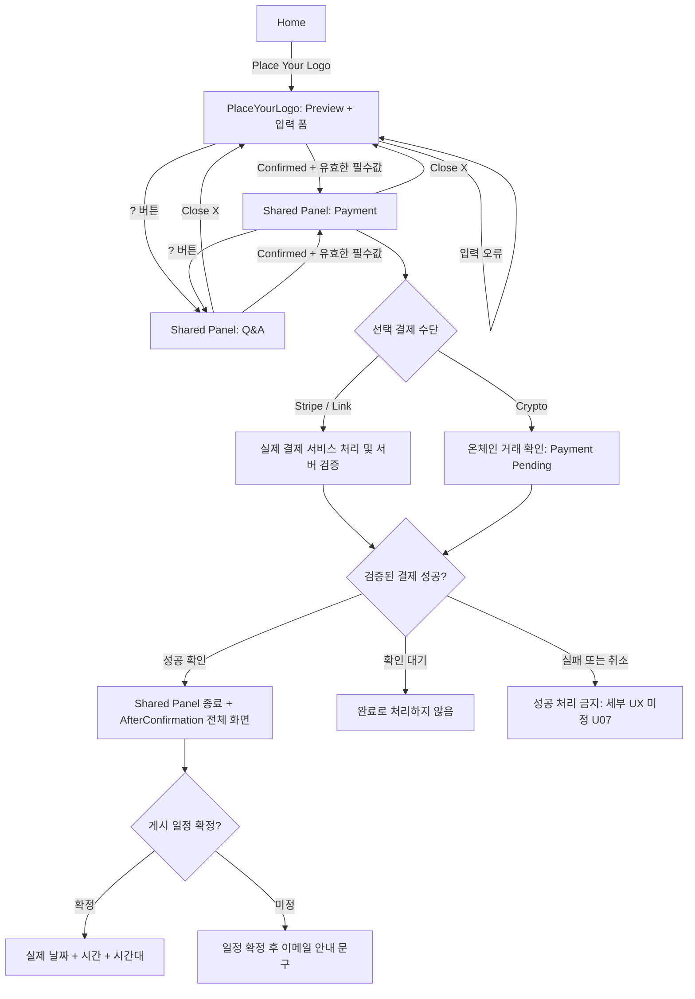
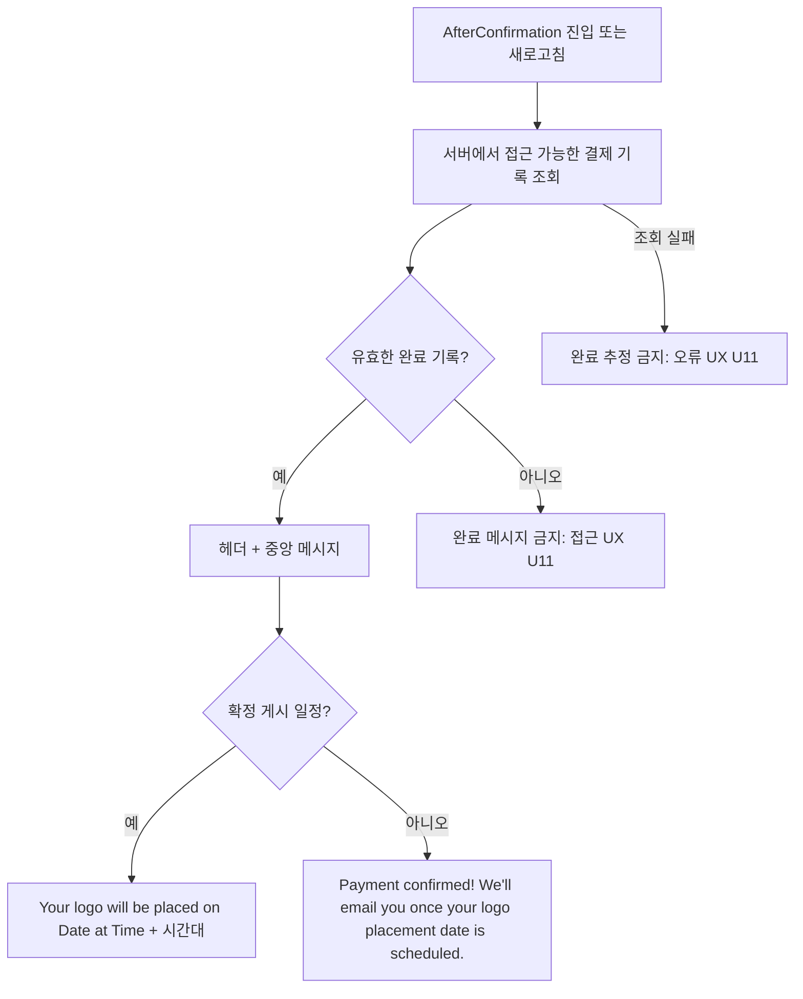

# FLOW — Logo Placement

동작 기준은 [SPEC.md](SPEC.md). 경로는 화면 식별이며 Home 실제 경로는 U01 확인 대상이다. Payment와 Q&A는 페이지 경로가 없는 Shared Panel 콘텐츠다.

## 1. 기본 흐름

Q&A에서 Confirmed를 통해 Payment로 교체한다는 흐름은 Step 1 Confirmed 규칙을 적용한 것이다. 별도 Back to Payment 버튼을 추가하는 결정은 없다(U12). 기존 pending 결제가 있으면 재진입을 새 결제 생성으로 취급하지 않는다.

## 2. Shared Panel 상태 전이

| 현재 상태 | 이벤트 | 다음 상태 | 유지/처리 |
| --- | --- | --- | --- |
| closed | 유효한 필수값 + Step 1 Confirmed | payment | 이메일·로고·결제 선택 유지 |
| closed | 유효하지 않은 입력 + Confirmed | closed | 결제 시작 금지 |
| closed | ? 클릭 | qa | 입력값 유지, FAQ 콘텐츠 U04 |
| payment | ? 클릭 | qa | Payment 콘텐츠 교체, 실제 결제 상태 유지 |
| qa | 유효한 입력 + Confirmed | payment | 기존 거래 확인, 중복 생성 금지, 입력 변경 정책 U12 |
| payment 또는 qa | Close(X) | closed | 입력 및 실제 결제 상태 유지 |
| 모든 패널 상태 | 서버에서 결제 성공 확인 | closed + AfterConfirmation 이동 | 결제 관련 데이터 유지 |

패널을 닫거나 Q&A를 보더라도 실제 결제 결과가 도착할 수 있다. 화면 표시 상태로 결과를 버리거나 완료를 추정하지 않는다. 구체적인 결과 전달·복구 방식은 기존 연동을 확인하며 U07/U12를 따른다.

## 3. 결제와 영수증

| 수단 | 확인 전 | 완료 근거 | 완료 후 |
| --- | --- | --- | --- |
| Stripe | 기존 Stripe 흐름을 재사용 | 서버가 실제 서비스 성공 검증 | 독립 AfterConfirmation으로 이동 |
| Link | 기존 Stripe/Link 흐름을 재사용 | 서버가 실제 서비스 성공 검증 | 독립 AfterConfirmation으로 이동 |
| Crypto | 거래 확인 중 Payment Pending | 온체인 정상 거래 확인, 세부 기준 U06 | 독립 AfterConfirmation으로 이동하고 입력 이메일로 영수증 발송 |

- Step 1 Confirmed는 결제 요청 단계 진입이며 결제 완료 이벤트가 아니다.
- 거래 미확인, 연동 부재, 조회 오류는 성공 근거가 아니다.
- pending/confirmed인 동일 결제에 새 중복 요청을 만들지 않는다.
- Q&A 전환과 Close(X)는 결제 취소 이벤트가 아니다.
- Crypto 영수증의 금액·통화·거래 해시·결제 일시는 실제 검증 데이터에서 가져온다.
- 영수증 발송 상태는 결제 성공과 별개다. 실제 메일 연동 없이 발송 완료 표시를 하지 않는다.
- 패널 내 완료 버튼을 다시 눌러야 이동하는 단계를 만들지 않는다. 슬라이드 4의 완료 안내와 `!` 아이콘 배치는 U09이다.

## 4. 완료 페이지 접근 흐름

유효한 완료 기록을 확인하기 전에는 결제 완료 안내를 표시하지 않는다. 로고 Preview·입력 폼·Payment/Q&A 패널은 이 페이지에 표시하지 않는다. 결제 성공은 게시 일정 확정을 뜻하지 않는다.

## 5. 구현 전 결정이 필요한 분기

- 결제 실패·취소·만료·오송금·재시도 및 pending 새로고침 복구: U07.
- 입력값 변경과 기존 거래의 관계, Q&A에서 결제로 복귀하는 상세 UX: U12.
- 메일 미연동/발송 실패 시 안내, 일정 알림 메일: U08.
- 완료 기록의 인증·식별, 무효 접근 및 조회 실패 대응: U11.
- Crypto 체인·자산·검증 기준과 실제 송금 UX: U06.
- 모바일에서 기본 화면과 Shared Panel을 함께 배치하는 방식: U10.

이 분기를 임의의 정책·날짜·금액·성공 상태로 채우지 않는다. 상세 목록과 수용 조건은 SPEC.md에 따른다.
