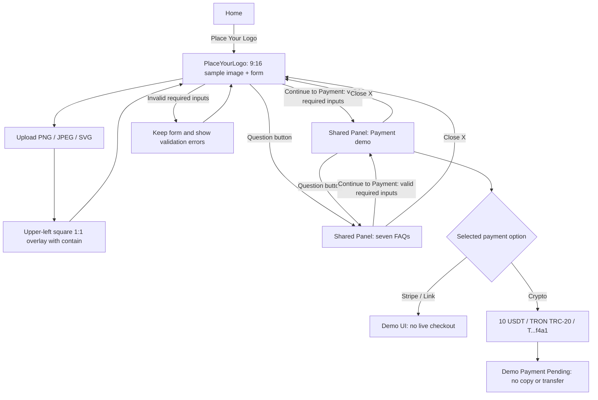
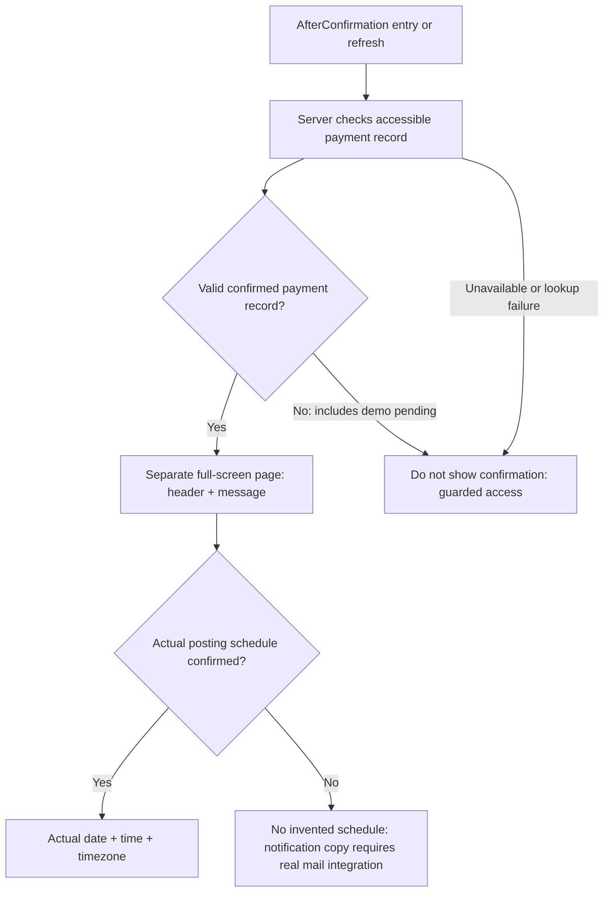
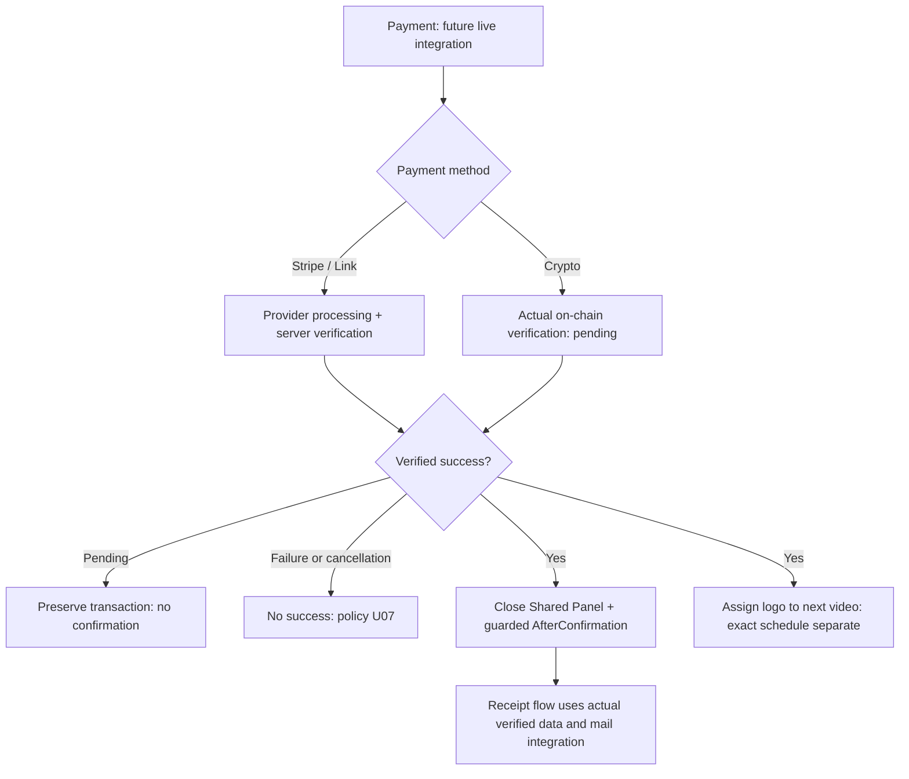

# FLOW — Place Your Logo / Phase 1

기준: [SPEC.md](SPEC.md). 대상은 `nabin3130/real-homies-club-website`의 `feature/place-your-logo`다. Phase 1은 결제 UI 데모이며 실제 결제나 완료 전환이 없다. 이번 변경은 문서만 포함한다.

## 1. Phase 1 기본 흐름

- 기본 폼의 결제 옵션 위에 `$10 USD — one-time payment`와 상품 범위를 표시한다.
- Payment 패널에는 `Total: $10 USD`와 로고 1개/영상 1개/동일 영상 TikTok·YouTube·Instagram 교차 게시 요약을 표시한다.
- `Continue to Payment`는 유효성 검사 후 패널을 여는 동작이며 결제 성공이 아니다. 기존 Step 1 `Confirmed` 문구를 대체한다.
- Preview는 샘플 이미지이며 영상 재생·영상 생성·로고 위치 조절은 없다. 정확한 asset·크기·여백은 U03이다.
- 주요 feature CTA는 #7C3AED → hover #171717, 흰색 글자, 200ms transition이다.
- Crypto pending에는 완료 전환 화살표가 없다. 데모는 실제 거래 검증·메일 발송·next-video 배정을 발생시키지 않는다.

## 2. Shared Panel 상태 전이

| 현재 | 이벤트 | 다음 | 유지 / 처리 |
| --- | --- | --- | --- |
| closed | 유효한 입력 + Continue to Payment | payment | 폼 유지, 선택 수단의 데모 표시, 실제 결제 생성 없음 |
| closed | 오류 입력 + Continue to Payment | closed | 오류 안내, 폼 유지 |
| closed | ? | qa | 폼 유지, 확정 FAQ 7개 표시 |
| payment | ? | qa | 동일 영역 교체, 폼·선택값·데모 상태 유지 |
| qa | 유효한 입력 + Continue to Payment | payment | 동일 영역 교체, 데모 재표시 |
| qa | 오류 입력 + Continue to Payment | qa | 오류 안내, Payment로 전환하지 않음 |
| payment 또는 qa | Close(X) | closed | 이메일·로고·선택값 유지 |
| 모든 상태 | 데모 클릭·대기·새로고침·송금 주장 | 완료 전환 없음 | confirmed 기록 생성·AfterConfirmation 승인 금지 |

표시 상태는 `closed | payment | qa`이며 Payment/Q&A는 동시에 열리지 않는다. 별도 페이지·탭을 만들지 않는다. 모바일에서도 기본 화면과 같은 Shared Panel 구조를 유지한다(U10).

## 3. 결제 데모와 FAQ

| 수단 | Phase 1 표시 | 금지 동작 |
| --- | --- | --- |
| Stripe | 선택 수단 데모 + Total: $10 USD | live checkout, 실제 세션 생성·청구·제공자 리다이렉트 |
| Link | 선택 수단 데모 + Total: $10 USD | live checkout, 실제 세션 생성·청구·제공자 리다이렉트 |
| Crypto | Total: $10 USD, 10 USDT, TRON / TRC-20, T...f4a1, Payment Pending, 데모 안내 | 주소 Copy·clipboard·실제 송금 QR·wallet 연결·송금·confirmed 전환 |

Q&A는 SPEC의 확정 영문 질문·답변 7개를 그대로 사용한다. 순서와 의미는 아래와 같다.

1. 배치: 영상 왼쪽 위 정사각형 영역, 로고 원래 비율 유지.
2. 시청자: TikTok 주로 동남아시아 및 호주·나이지리아 시청자 포함. YouTube 주로 대한민국.
3. 가격: $10 USD 일회성, 로고 1개/영상 1개, 동일 영상을 TikTok·YouTube·Instagram에 교차 게시.
4. 배정: 실제 결제 확인 후 다음 영상에 배정. 정확한 게시 날짜·시간의 사전 보장 없음.
5. 선택: 특정 영상 선택 불가.
6. 파일: PNG / JPEG / SVG.
7. 환불: 법률상 필요한 경우 외 환불 없음.

데모 pending은 FAQ의 실제 결제 확인 조건을 충족하지 않는다. 10 USDT는 데모 표시값이며 실결제 환율·수수료 정책은 U06이다.

## 4. AfterConfirmation 접근 보호

- Phase 1 데모에서 이 페이지로 이동하는 성공 경로는 없다.
- URL, 클라이언트 상태, query parameter, 데모 클릭, 타이머로 보호를 우회하지 않는다.
- 유효한 실제 완료 기록을 확인하기 전에는 완료 메시지를 표시하지 않는다. 무효 접근·조회 실패 UI는 U11이다.
- 페이지는 Shared Panel 밖의 독립 화면이며 Preview·입력 폼·Payment/Q&A를 표시하지 않는다.
- 일정 확정 문구는 실제 일정과 시간대로 표시한다. 기존 일정 미정 이메일 안내는 실제 메일 연동이 있을 때만 사용한다(U08).

## 5. 향후 실제 결제 흐름 — Phase 1 비활성

- 실제 결제 활성화에는 별도 요청과 U05/U06/U07/U08/U11/U12의 관련 결정이 필요하다.
- 패널 닫기·Q&A 전환은 거래 취소가 아니다. 실제 결과를 표시 상태와 독립적으로 처리한다.
- Payment 재진입으로 기존 pending/confirmed 거래를 중복 생성하지 않는다.
- 사용자 송금 주장·단순 거래 해시 입력·조회 실패는 성공 근거가 아니다.
- 성공은 서버 검증 이후에만 인정한다. 패널 내 추가 완료 버튼 클릭이나 영수증 발송 완료를 페이지 이동 조건으로 추가하지 않는다.
- 결제 성공과 메일 발송 상태는 분리한다. 실제 데이터·연동 없이 발송 완료나 게시 일정을 표시하지 않는다.

## 6. 남은 결정과 검증 경계

- U02: 파일 제한·검사·SVG 안전 처리, 이메일 검증·오류 문구·기본 결제 선택.
- U03: 샘플 이미지 asset, 정사각형 영역 크기·상단/왼쪽 여백. 위치·비율·contain은 확정.
- U04: FAQ 7개 확정, 보류 항목 아님.
- U05/U06: 실제 결제 상품·식별 구조, 실주소·거래 검증·환율·수수료. 데모 값은 확정.
- U07: 실패·취소·만료·오송금·중복·재시도·복구. 환불의 법률 예외는 확정.
- U08: 영수증·일정 알림 메일, 일정 데이터·시간대.
- U09: 완료 안내 위치와 기존 ! 아이콘 존치·설명.
- U10: 모바일 패널 배치·breakpoint·폭.
- U11: 완료 기록 접근 인증·식별·조회, 무효 접근·실패·뒤로가기 UX.
- U12: 향후 거래 진행 중 입력 변경·잠금·Q&A 재진입 정책.

Phase 1 데모 동작 검증과 향후 실제 연동 검증은 구분한다. 미정·미연동 항목을 통과했다고 보고하지 않는다. 전체 수용 조건은 SPEC §8을 따른다. UI는 별도 요청 시 feature 브랜치에서만 구현하며 main 병합·production 배포는 하지 않는다.

## Development / Vercel Preview confirmation demo

- Payment 패널에 `Preview Confirmation Page` 링크를 개발 환경 및 Vercel Preview에서만 표시한다. `Continue to Payment`는 계속 Payment 패널을 연다.
- `/AfterConfirmation?preview=1`은 서버 환경 검사를 통과한 경우에만 `Preview / Demo Mode` 화면을 표시한다. production에서는 같은 URL도 기존 접근 차단 화면을 표시한다.
- 이 별도 데모 경로는 결제 확인이나 실제 완료 승인이 아니다. 결제 기록 생성, 메일 발송, 로고 배정, 결제 활성화를 수행하지 않는다. 날짜·시간을 만들지 않는다.
- 일반 `/AfterConfirmation` 접근과 새로고침의 기존 verified-payment 보호 규칙을 유지한다. 실제 서버 결제 확인 연동은 아직 구현되지 않았으며 계속 fail closed 상태다.
